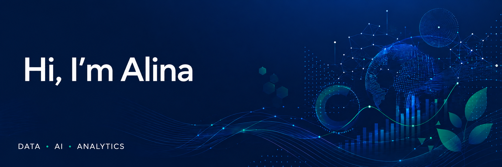

### Data and AI enthusiast building practical technology for social impact

I’m a Business Administration - Management Information Systems student at San José State University with a 3.75 GPA and a growing focus on data analytics, business systems, and responsible AI.

## About me
Through academic projects and hands-on experience, I’ve worked with SQL, Python, Oracle databases, Microsoft Excel, Power BI, Tableau, CRM systems, data modeling, and financial analysis. I enjoy translating complex information into clear reports, visualizations, and actionable business insights.

- Building data and AI projects with Python, SQL, and responsible technology
- Designing databases, business workflows, dashboards, and actionable reports
- Seeking a Summer 2027 internship in data analytics, business analytics, or business systems

## Featured project

### [AI-Powered Environmental Issue Detection for San Jose](YOUR_PROJECT_REPOSITORY_LINK)

A multimodal AI prototype that transforms unstructured environmental reports and images into structured records for preliminary human review.


- Schema-guided JSON extraction
- Environmental issue and urgency classification
- Location, department, language, and affected-entity extraction
- Image analysis for visible environmental conditions
- Validation logic and failure-case testing
- Human oversight and responsible-use safeguards

**Technologies:** Python · OpenAI API · Google Colab · JSON

[View the notebook](https://colab.research.google.com/drive/1h3ky9RWIrerttjD5q8yNm6aZHXRMq6sa?usp=sharing) · [View the repository](https://github.com/alina-rakhimbaeva-2027/AI-Powered-Environmental-Issue-Detection-for-San-Jose)

## Skills and tools

```text
Python                 AI API integration
Data analysis           Prompt engineering
JSON and validation    Multimodal AI
Google Colab            Git and GitHub
Responsible AI          Technical documentation
```

## Currently learning

- Reliable AI workflow design
- Model-output evaluation
- Human-in-the-loop systems
- Data visualization and dashboards
- Database integration
- Portfolio-ready analytics projects

## Connect with me
 
- [LinkedIn](https://www.linkedin.com/in/alina-rakhimbaeva/)
- [Resume](https://drive.google.com/file/d/1UydoLefvnSRHMCrac6l0DIcQP3HbTEp_/view?usp=sharing)

Thanks for visiting my profile!
